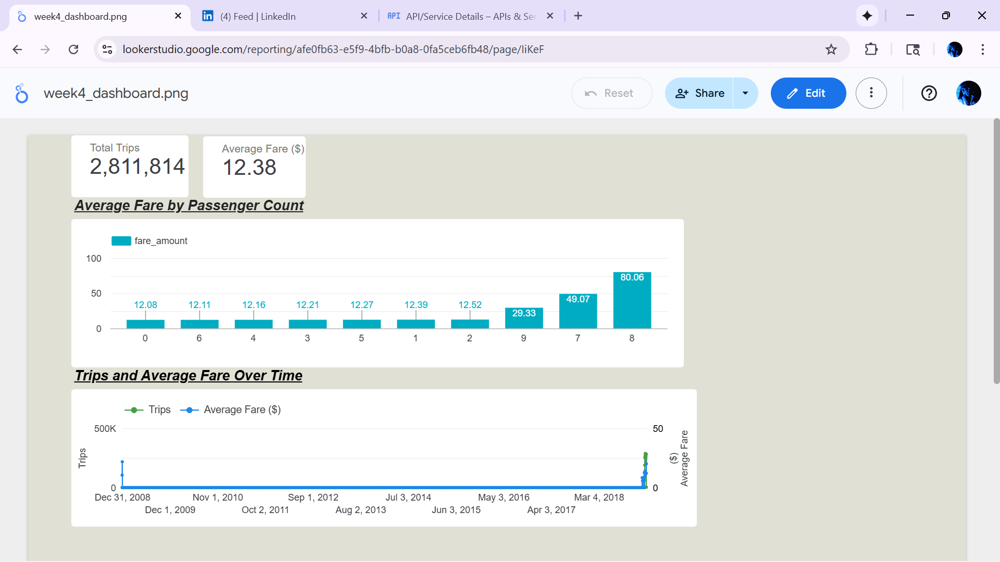

**Week 1 – Initial Setup & Data Loading**

**Tasks Completed:**

Set up a GCP free-tier project.

Created a Cloud Storage bucket for raw data.

Installed and configured gcloud CLI.

Wrote a Python script to upload CSV files to the bucket.

Loaded the data into BigQuery with auto-detected schema.

Ran a query to validate the data.

**Skills Practiced:**

Python (file handling, scripts)

GCP Authentication & CLI

Google Cloud Storage

BigQuery

SQL & Data Validation

Basic ETL (Extract → Load → Query)

**Files in Week 1:**

upload_to_bucket.py

sample_data.csv

README.md

--------------------------------------------

**Week 2 – Data Cleaning & Automated ETL Pipeline**

**Tasks Completed:**

Cleaned raw CSV data locally using Pandas (clean_data.py).

Uploaded cleaned data to Google Cloud Storage (upload_to_bucket.py).

Loaded cleaned data into BigQuery (cleaned_sample_table).

Automated the entire process using etl_pipeline.py (clean → upload).

**Skills Practiced:**

Python (Pandas, file I/O)

Google Cloud Storage

BigQuery

Data Cleaning & Transformation

ETL Pipeline Design & Automation

**Files in Week 2:**

clean_data.py

etl_pipeline.py

README.md (updated documentation)

--------------------------------------------------------

---

## Week 3 – Big Data Processing with PySpark on Dataproc

**Tasks Completed:**
- Created a Dataproc cluster to process large datasets using PySpark.
- Ran PySpark job to clean, transform, and aggregate trip data at scale.
- Wrote cleaned output back to Google Cloud Storage (`/week3/output/`).
- Defined schema, validated data types, and ensured no data loss.

**Skills Practiced:**
- PySpark (RDDs & DataFrame API)
- Google Cloud Dataproc (cluster provisioning and distributed jobs)
- Distributed data transformation and optimization
- Cloud Storage (Input / Output data paths)

**Key Script(s):**
- `process_big_data.py`

---

---

## Week 4 – Data Insights & Visualization

In Week 4, the processed dataset from Week 3 was analyzed and visualized to extract insights.

**Tasks Completed:**
- Loaded PySpark-processed output from GCS into BigQuery.
- Performed analytical SQL queries to explore trip behavior and fare patterns.
- Built a Looker Studio dashboard connected directly to BigQuery.

**Dashboard Visualizations:**
| Visualization | Description |
|--------------|-------------|
| **KPI Cards** | Total Trips and Average Fare across dataset. |
| **Average Fare by Passenger Count** | Bar chart showing fare variation by group size. |
| **Trips & Average Fare Over Time** | Dual-axis time-series showing volume vs. pricing trend. |

**Key Insights:**
- Average fare remains stable for passengers counts 1–6, but increases sharply for 7+ passengers.
- Trip volume varies significantly over time, indicating seasonal or demand-driven fluctuations.
- Average fare remains consistent even when total trips spike.

**Dashboard Screenshot:**

