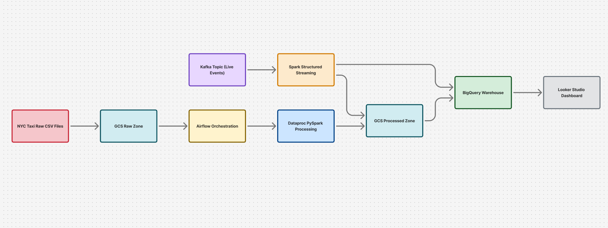
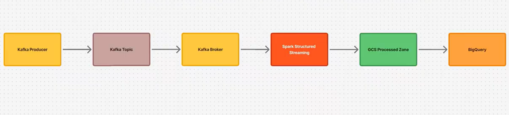
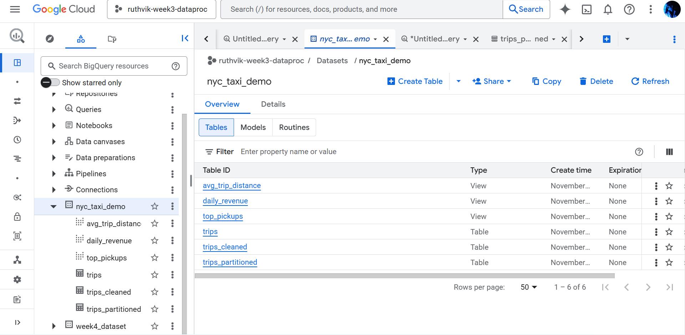
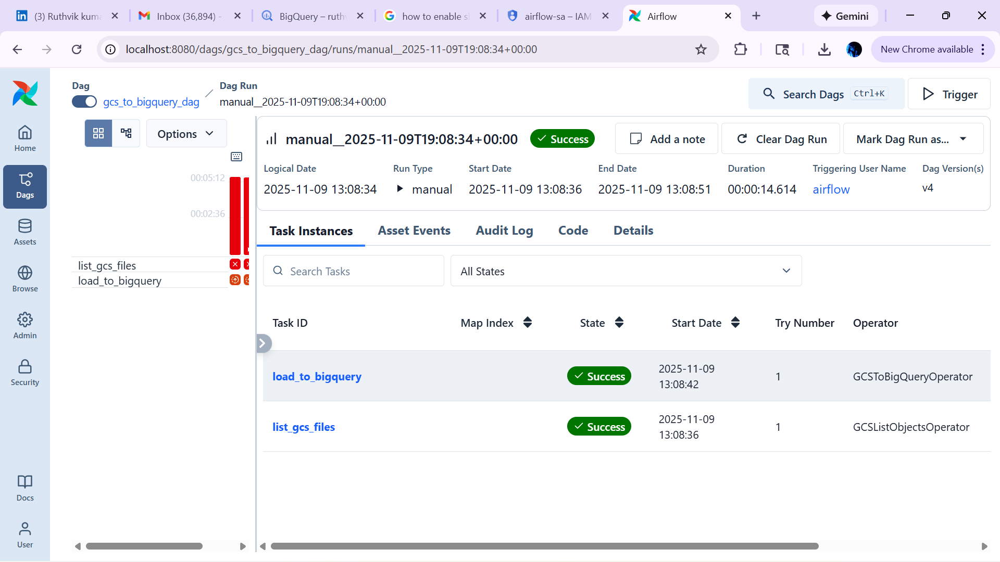
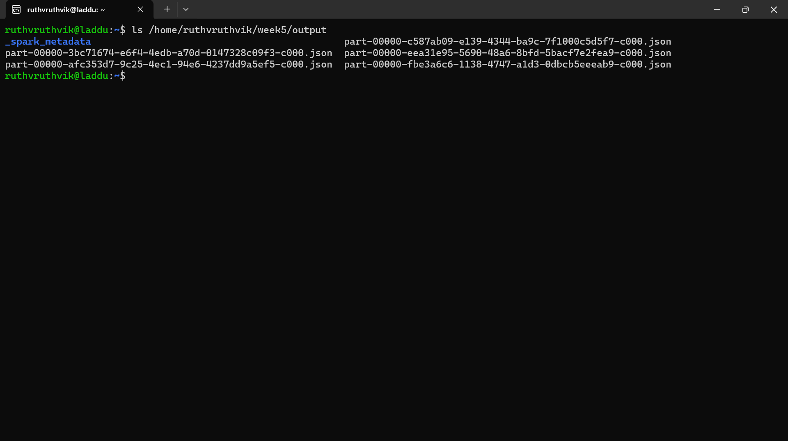
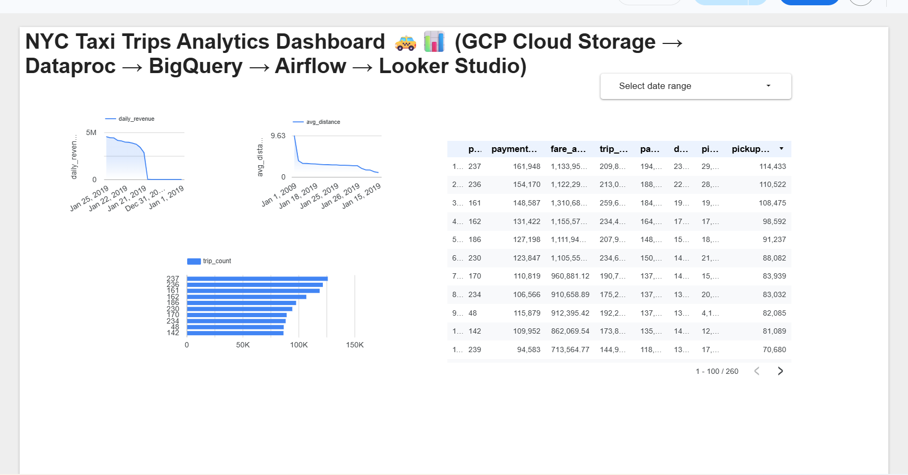

# 🚕 End-to-End Data Engineering Pipeline (GCP + Kafka + PySpark + Airflow)

This project demonstrates a **production-grade data pipeline** built using  
**Google Cloud Platform, Apache Kafka, PySpark on Dataproc, Airflow, and BigQuery**,  
including both **batch processing** and **real-time streaming**.

🔗 **YouTube Walkthrough:** https://youtu.be/Cb2BpFoL30g  
🔗 **Looker Studio Dashboard:** https://lookerstudio.google.com/reporting/9d456692-cd86-460e-9bbd-58e1bdc4413b  

---

## 📌 Architecture Overview

### **Batch Pipeline (ETL)**
Raw CSV → GCS Raw Zone → PySpark on Dataproc → GCS Processed Zone → BigQuery → Dashboard

### **Real-Time Pipeline**
Kafka Producer → Kafka Topic → Spark Structured Streaming → BigQuery Live Table

---

# 🚀 **1. Batch ETL Pipeline (GCP)**

### **1.1 Upload raw dataset to GCS**

- Stored raw CSV in: `gs://<bucket>/week3/big_dataset.csv`

📸 Screenshot:  

---

### **1.2 Dataproc PySpark Transformation**

PySpark cleans & transforms 2.7M+ rows:

- Schema enforcement  
- Null handling  
- Datetime conversion  
- Partitioning  
- Writes processed output to GCS  

📸 Dataproc Cluster Creation:  
.png)

📸 PySpark Output in GCS:  

---

### **1.3 Load to BigQuery**

Processed files loaded to BigQuery using:

- GCSToBigQueryOperator (Airflow)  
- Partitioned tables  
- Analytical views  

📸 BigQuery Table Preview:  

📸 BigQuery Views:  

---

# ⚙️ **2. Airflow Orchestration**

The full pipeline is automated with Airflow:

- List files in GCS  
- Run PySpark job (optional)  
- Load processed data into BigQuery  
- Generate views  

📸 Airflow DAG Run:  

---

# ⚡ **3. Real-Time Streaming (Kafka + Spark Structured Streaming)**

### **3.1 Kafka Setup**

- Created Kafka topics  
- Producer sends taxi trip events  
- Consumer verifies stream  

### **3.2 Spark Structured Streaming Job**

- Reads Kafka JSON messages  
- Normalizes timestamps  
- Writes micro-batches to output sink  
- Fault-tolerant with checkpointing  

📸 Spark Streaming Log (Optional screenshot):  

---

# 📊 **4. Looker Studio Dashboard**

Interactive dashboard includes:

- Revenue trends  
- Trip density  
- Peak hours  
- Popular pickup zones  

📸 Dashboard screenshot placeholder  

---

# 🧰 **Tech Stack**

| Category | Tools |
|---------|-------|
| Cloud | GCP (GCS, Dataproc, BigQuery, Composer) |
| Processing | PySpark, Spark Structured Streaming |
| Streaming | Apache Kafka |
| Orchestration | Airflow |
| Dashboard | Looker Studio |
| Language | Python, SQL |

---

# 📈 Key Achievements

- Processed **2.7M+ taxi records** end-to-end  
- Automated entire pipeline with Airflow  
- Built **real-time + batch** hybrid architecture  
- Created reusable architecture used in real data engineering workflows  
- Developed a public YouTube walkthrough  

---

# 📁 Repository Structure

gcp-data-pipeline-project/
│── week1/ # Raw ingestion
│── week2/ # Cleaning & validation
│── week3/ # PySpark + Dataproc job
│── week4/ # BigQuery analytics
│── week5-streaming/ # Kafka + Spark streaming
│── dags/ # Airflow DAGs
│── screenshots/ # Architecture + UI screenshots
│── README.md

---

---

# ▶️ How to Run This Project

### **Batch Pipeline**
1. Upload dataset to GCS  
2. Spin up Dataproc cluster  
3. Run PySpark job  
4. Load into BigQuery  
5. Use Looker Studio for visualization  

### **Streaming Pipeline**
1. Start Kafka broker & topic  
2. Run producer script  
3. Start Spark Structured Streaming job  
4. Query live data  

---

# 📬 Contact

**Ruthvik Kumar Yadav Maram**  
📍 Schaumburg, IL  
📧 ruthvikyadav930@gmail.com  
🔗 LinkedIn: https://www.linkedin.com/in/ruthvikyadav/  
🔗 GitHub: https://github.com/Ruthvikyadavm  
🔗 YouTube Demo: https://youtu.be/Cb2BpFoL30g  

---

